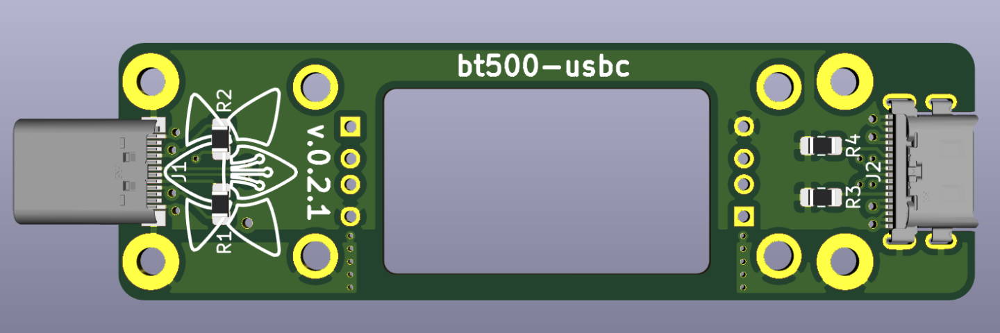

# bt500-usbc
### USB Type-C mod for the BT-500 bluetooth adapter

A USB C mod board for the Handheld Scientific BT-500 Bluetooth keyboard & mouse adapter,
featuring enhanced mounting and high-current capabilities.

### Features
- USB C host port and peripheral port
- M2 mounting holes
- High-current power traces bypassing the BT-500 for increased power delivery to peripherals
- 500 mA or 1.5 A peripheral current setting

### Instructions
1. Get a copy of the board, or use oshpark or jlcpcb to manufacture it.
2. Get the necessary components.
3. Assemble the board and test it.
4. Optionally, laser cut a sandwich-style case for the adapter.

`made w/ 💜 by vivi, 2020`
